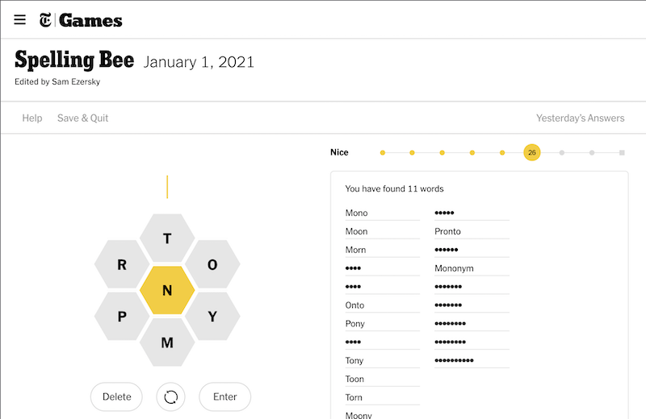

# NYT Spelling Bee Trainer

A chrome extension to help solve the daily [NYT Spelling Bee](https://www.nytimes.com/puzzles/spelling-bee) puzzle without giving away answers.

Uses [nytbee.com](https://nytbee.com) to get daily answer information.

## Installation

1. Clone this repo or download the source files.
2. In a blank Chrome window, navigate to `chrome:extensions` in the URL bar.
3. Ensure "Developer mode" is enabled in the upper right-hand corner.
4. In the upper left-hand corner, click "Load unpacked".
5. Select the directory with the source files and click "OK".
6. Start playing!
